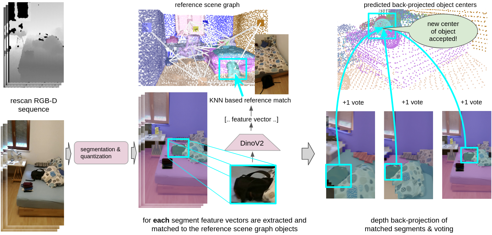
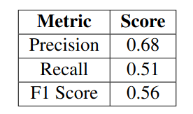
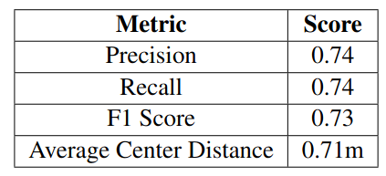

<div align='center'>
<h2 align="center"> OD3DU: Object Detection based 3D Scene Understanding </h2>

<a href="linkedin.com/in/elena-koller-3b94041b4">Elena Koller</a><sup>1</sup>, 
<a href="https://cvg.ethz.ch/team/Dr-Zuria-Bauer"> Dr. Zuria Bauer</a><sup>1</sup> , 
<a href="https://cvg.ethz.ch/team/Dr-Daniel-Bela-Barath"> Dr. Dániel Béla Baráth</a> <sup>1</sup>
<a href="https://cvg.ethz.ch/team/Prof-Dr-Marc-Pollefeys"> Prof. Dr. Marc Pollefeys</a> <sup>1</sup>

<sup>1</sup>ETH Zurich   

OD3DU operates in low-dynamic real-world indoor environments. Given a reference scene graph representing the scene at time t0 and an RGB-D rescan of the scene at time ti, OD3DU predicts the reference 3D object instance centers in the rescan. Since the environment is low-dynamic, scene changes can not be captured directly by the camera but have to be inferred post-hoc.



</div>


## Code Structure:

The code is organized the following way:
```
├── OD3DU
│   ├── configs                         <- configuration definition
│   ├── src
│   │   │── preprocessing               <- preprocessing of scene graph
│   │   │── gt_annotations              <- generates 2D ground truths 
│   │   │── rescan_segmentation         <- segmentation of the rescan sequence using Mask2Former x DinoV2 (needs docker)
│   │   │── object_2D_features          <- generates object features for both reference scene graph and rescan
│   │   │── segment2object_matching     <- matches predicted segments to reference objects
│   │   │── center_prediction_3D        <- predicts 3D object centers
│   │   
│   ├── notebooks                       <- jupyter notebooks: visualizations and result display
│   ├── scripts                         <- implementation scripts 
│   │── utils                           <- util functions
│   │── environment.yml                 <- conda environment
│   │── README.md                    
```

## Dependencies:

The project has been tested on Ubuntu 20.04.
The main dependencies of the project are the following:

```yaml
python: 3.8.20
cuda: 11.8
```
You can set up an environment as follows :
```bash
git clone https://github.com/elikoller/OD3DU.git
cd OD3DU

conda env create -f environment.yml
```
Other dependences:

For the semantic segmentation (rescan_segmentation) a separate docker container must be employed due to incompatible dependencies (<a href="https://github.com/facebookresearch/dinov2/issues/353"> docker source</a>). The docker can be pulled the following way:


```bash
docker pull spped2000/dinov2manyproblem:latest
```

## Download Dataset: 3RScan + 3DSSG + Metadata
Download [3RScan](https://github.com/WaldJohannaU/3RScan) and [3DSSG](https://3dssg.github.io/). Move all R3Scan files to ``3RScan/scenes/``, all files of 3DSSG to a new ``3RScan/files/`` directory within 3RScan. The additional meta files are available to be downloaded [here](https://drive.google.com/file/d/1abvycfnwZFBBqYuZN5WFJ80JAB1GwWPN/view). Download the additional meta files and move them to ``3RScan/files/``.  The source of the meta files is this ([repo](https://github.com/y9miao/VLSG)). Additionaly, generate ``labels.instances.align.annotated.v2.ply`` (aligns the reference and rescan) using [this](https://github.com/ShunChengWu/3DSSG/blob/main/data_processing/transform_ply.py) program. Add the newly generated ply files to the corresponding scene folder in ``3RScan/scenes/``. Finally, add the two [scan split](data/scan_splits/) in the ``3RScan/files/`` directory. 
The structure should be:

```
├── 3RScan
│   ├── files                 <- all 3DSSG files and additional meta files
│   │   scan split files      <- the resplit files for the scenes
│   │   meta files
│   ├── scenes                <- scans (3RScan)
```

Please do not forget to unzip the sequence files within the scenes directory.


## Code Usage
Once you have everything prepared, we can start to precess the dataset and do our computations. Please note the following: for every script you need to adjust the env variables to correspond to your file path (OD3DU_SPACE, San3R_ROOT_DIR, CONDA_BIN). You can do this in the corresponding file in the scripts directory. Within the scripts there are the commands for the program exectution. If you are not planning on doing evaluations on the train set, please comment the commands out which start the program for the train set. We only store evaluation results and the preprocessing for the train set.

You can find the different steps of OD3DU explained in depth in the corresponding thesis ADD LINK HERE.

After running all scripts the final folder structure will look the following way:

```

├── 3RScan
│   ├── files                 <- all 3RScan and 3DSSG meta files and annotations
│   │   ├──Segmentation       <- Segmentations of the input rescan
│   │   ├──Features2D         <- Object features generated by DinoV2 (reference and rescan)
│   │   ├──Predicted_Matches  <- input segment to reference object matches
│   │   ├──Predicted_Centers  <- Predicted 3D object centers
│   │   ├──Results            <- if evaluations are run, all results will be saved in this folder
│   │   ├──orig               <- Scene Graph Data
│   │   ├──patch_anno         <- 2D Ground truth patch-object annotation of the scenes
│   │   ├──gt_projection      <- 2D Ground truth projection annotation of the scenes
│   │   meta files
│   ├── scenes                <- scans
```


### Dataset Pre-process (Reference Scene and Rescan):
We pre-process the information provided in the 3RScan dataset and the metafiles in order to get scene graph information along with 2D and 3D ground truths. The code for the preprocessing can be found here ``src/preprocessing``.

The first script generates the scene graph datastructures (edges, 3D bounding boxes, 3D object centers, object ID's) of the scenes for both the train and test set. If you are not intending on performing parameter optimizations based on the train set, you can comment the commands for the train set out.

```bash
bash scripts/preprocess/scan3r_data_preprocess.sh
```
The resulting processed data will be save to  ``3RScan/files/orig``.


### Generating (Ground Truth) Object Annotation (Reference Scene and Rescan):
R3Scan provides a semantically annotated mesh on instance level. To extract 2D ground truth projections for the rescan and object annotations for the reference scan we run the following script. Since some edges of the projection can be jittery we also compute a ground truth on patch wise level (30x30  pixels). This is later used for evaluation purposes. 

```bash
bash scripts/gt_annotations/scan3r_gt_annotations.sh
```

The results will be saved in ``3RScan/files/gt_projection`` and ``3RScan/files/patch_anno``.


### Semantic Segmentation for Rescan Input:

For the rescan scenes at time ti we segment the input frames using a pretrained model. We chose the semantic segmentation model, built on a[Mask2Former](https://github.com/facebookresearch/Mask2Former) pipeline with a [DinoV2](https://github.com/facebookresearch/dinov2) ViT-g/14 backbone and trained on ADE20K. To run the semantic segmentation, please employ the [docker container](#dependencies) and let the script run within that container. From this script we obtain the semantic masks, along with corresponding bounding boxes and mask ID's. Again for the evaluation purposes we also store the masks on a patch-wise level to be able to compare them to the grond truth.


```bash
bash scripts/dino_segmentation/semantic_segmentation_dino.sh
```

The segmentation files for the rescans will be stored in this directory: ``3RScan/files/dino_segmentation``

### Feature generation (Reference Scene and Rescan):
In order to obtain a featrue representation of the object present in both reference scene and rescan, we compute feature vectors using [DinoV2](https://github.com/facebookresearch/dinov2). We compute object features for the reference scene on the basis of the object [annotations](#generating-ground-truth-object-annotation-reference-scene-and-rescan) of the scene graph and for the rescan we use the [predicted masks](#semantic-segmentation-for-rescan-input) to extract the objects.

To generate the features, please use : 
```bash
bash scripts/features2D/scan3r_dinov2.sh
```

The features for the reference scan can be found in ``3RScan/files/Features2D/projection`` and for the rescan in ``3RScan/files/Features2D/dino_segmentation``.


### Segment to Object Matches (Rescan):
This script computes the correspondance between the [predicted segments](#semantic-segmentation-for-rescan-input) and the reference objects based on the [computed features](#feature-generation-reference-scene-and-rescan). The result is a mapping between segment to object instance.

To generate the matches, use : 
```bash
bash scripts/segment_to_object_matching/obj_matches.sh
```

The resulting file will be saved in ``3RScan/files/Features2D/Predicted_Matches``. You can use the [following notebook](notebooks/segment2object_matching/visualization_predicted_mask2object_matches.ipynb) to get a visualization of ground truth annotation vs predicted segment annotation.


### Predict 3D Object Centers (Rescan):
The last step is to predict the 3D object centers based on the [predicted segmentation](#segment-to-object-matches-rescan) to object mappings.  For this you can run the following script:

```bash
bash scripts/3D_center_prediction/predict_objects.sh
```
The predicted centers will be stored in ``3RScan/files/Features2D/Predicted_Centers``. We again provide a jupiter notebook [here](notebooks/3D_center_prediction/visualization_predicted_objects.ipynb) to visualize the predicted object centers along with the ground truth mesh of the rescan and the reference scene.


## Evaluation and Parameter "Training":
The scripts currently run both the pipeline and evaluation for both the train and test set - except for the final 3D object center prediction. There we store the final results only for the test set. If you want to fine tune new parameters or run evaluations, you can change the parameters in the corresponding config files. You can evaluate the pipeline at 2 fixed points: The [segment to object matching](#segment-to-object-matches-rescan) and the final [3D object center prediction ](#predict-3d-object-centers-rescan). We provide the following metrics: F1 Score, Precision, Recall and for the centers also the average center distance. 


### Evaluating Segment to Object Matching 

You can evaluate both the train and test set for the segment to object matches using: 

```bash
bash scripts/segment_to_object_matching/computation.sh
```
The results are saved in ``3RScan/files/Results/Matching_Prediction``  for the train and test split. We provide a jupyter [notebook](notebooks/segment2object_matching/evaluation_segmetn2object_matching_display.ipynb) to read the results out into a Pandas frame.

Below we show the results of the test set for the segment to object matching with the current parameters:




## Evaluating 3D Object Center Prediciton

You can evaluate both the train and test set for the 3D object center prediction using: 

```bash
bash scripts/3D_center_prediction/predict_objects_statistics.sh
```

The results are saved in ``3RScan/files/Results/Center_Prediction``  for the train and test split. We provide a jupyter [notebook](notebooks/3D_center_prediction/evaluation_result_display.ipynb) to read the results out into a Pandas frame.

Below we show the results of the test set for the final 3D object center prediciton with the current parameters:




## Acknowledgments :recycle:
In this project we use (parts of) the official implementations of the following projects. We want to thank the respective authors for sharing the code for their works!
- [SceneGraphLoc](https://github.com/y9miao/VLSG) 
- [SGAligner](https://github.com/sayands/sgaligner) 
- [SceneGraphFusion](https://github.com/ShunChengWu/3DSSG)

