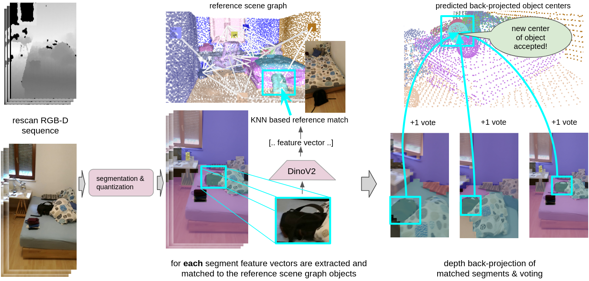

<div align='center'>
<h2 align="center"> OD3DU: Object Detection based 3D Scene Understanding </h2>

<a href="https://y9miao.github.io/">Elena Koller</a><sup>1</sup>, 
<a href="https://cvg.ethz.ch/team/Dr-Francis-Engelmann">Zuria Bauer</a><sup>1</sup> , 
<a href="https://cvg.ethz.ch/team/Dr-Daniel-Bela-Barath"> Dániel Béla Baráth</a> <sup>1</sup>

<sup>1</sup>ETH Zurich   

OD3DU operates in low-dynamic real-world indoor environments. Given a reference scene graph representing the scene at time t0 and an RGB-D rescan of the scene at time ti, OD3DU predicts the reference 3D object instance centers in the rescan. Since the environment is low-dynamic, scene changes can not be captured directly by the camera but have to be inferred post-hoc.



</div>


## Code Structure:

```
├── BT
│   ├── preprocessing         <- data preprocessing
│   ├── configs               <- configuration definition
│   ├── src
│   │   │── datasets          <- dataloader for 3RScan and Scannet data
│   │   
│   ├── scripts               <- implementation scripts 
│   │── utils                 <- util functions
│   │── README.md                    
```

### Dependencies:

The project has been tested on Ubuntu 20.04.
The main dependencies of the project are the following:


```yaml
python: 3.8.15
cuda: 11.6
```
You can set up an environment as follows :
```bash
git clone https://github.com/y9miao/VLSG.git
cd VLSG

conda create -n "BT" python=3.8.15
conda activate BT
pip install -r requirement.txt
```
Other dependences:

also we need python -m pip install pyviz3d for the visualization 

Some dependencies are useless and give errors: cat requirement.txt | xargs -n 1 pip install

this installs them and skipps whenever something is not working

also installed


the thing below is nt needed
```bash
conda activate VLSG
pip install -r other_deps.txt

cd thrid_party/Point-NN
pip install pointnet2_ops_lib/.
```

## Dataset Generation :hammer:
### Download Dataset - 3RScan + 3DSSG
Download [3RScan](https://github.com/WaldJohannaU/3RScan) and [3DSSG](https://3dssg.github.io/). Move all R3Scan files to ``3RScan/scenes/``, all files of 3DSSG to a new ``3RScan/files/`` directory within Scan3R. The additional meta files are available [here](https://drive.google.com/file/d/1abvycfnwZFBBqYuZN5WFJ80JAB1GwWPN/view?usp=sharing). Download the additional meta files and move them to ``3RScan/files/``.
The structure should be:

```
├── 3RScan
│   ├── files                 <- all 3RScan and 3DSSG meta files and annotations
│   │   ├──Features2D         <- Pre-computed patches features of query images
│   │   ├──Features3D         <- Visual features of 3D objects not yet
│   │   ├──orig               <- Scene Graph Data
│   │   ├──patch_anno         <- Ground truth patch-object annotation of query images
│   │   meta files
│   ├── scenes                <- scans
```

> To generate ``labels.instances.align.annotated.v2.ply`` for each 3RScan scan, please refer to the repo from 
[here](``https://github.com/ShunChengWu/3DSSG/blob/master/data_processing/transform_ply.py``).  https://github.com/ShunChengWu/3DSSG/blob/main/data_processing/transform_ply.py

(to do find out how that works because I got the link with the files from yang but the link expired :(      )

To unzip the sequence files within the §RScan/scenes/  you can use
directly in the terminal

go into the correct directory with the scan_ids

 find . -name '*.zip' -execdir unzip -o '{}' -d sequence \; -execdir rm -f '{}' \;
   

go to the scenes directory and type in the following find . -name '*.zip' -execdir unzip -o '{}' -d sequence \; -execdir rm -f '{}' \;
done


also some more confusing stuff is the following: the dataset did not provide the graphdata for the evaluation set so in this paper: the original validation set was taken and then split into validation and test. hence for the dataset only the test and validation set get accessed


### Dataset Pre-process :hammer:
After installing the dependencies, we download and pre-process the datasets. 

First, we pre-process the scene graph information provided in the 3RScan annotation. The relevant code can be found in the ``data-preprocessing/`` 
directory.  

E: Some changes happened I think the directory data-preprocessing is now called preprocessing only, also adjustment of the Data_Root_dir to the new one (plus the adding of the definition into the utis scan3r.py that you sent me)

Oh also there is Data root dir in a lot of graphs below 

Don't forget to set the env variables "VLSG_SPACE" as the repository path,  set "Data_ROOT_DIR" as the path to "3RScan" dataset and set "CONDA_BIN" to accordingly in the bash script.

```bash
bash scripts/preprocess/scan3r_data_preprocess.sh
```
The result processed data will be save to "{Data_ROOT_DIR}/files/orig".
<!-- > __Note__ To adhere to our evaluation procedure, please do not change the seed value in the files in ``configs/`` directory.  -->

### Generating Ground Truth Patch-Object Annotastion
To generate ground truth annotation, use : 
```bash
bash scripts/gt_annotations/scan3r_gt_annotations.sh
```
This will create a pixel-wise and patch-level ground truth annotations for each query image. These files will be saved  to "{Data_ROOT_DIR}/files/gt_projection and "{Data_ROOT_DIR}/files/patch_anno only for the eval and train set tho
the current number of the patches is 32x18 but this can be changed, look if there is also th, just take max instead of th == 0.2

while it migh be confusing the ground truth for the reference is actually the data we already have provided: our assumption is that we have the mesh -> so there for the reference scans we will actually compute with them. for the rescans however this is the actual ground truth which we will also use for comparison later on


### Elena's Code
the first approach involved bounduingboxes  intersection for speedup but this was slow & not good enough but it helped a lot to visualize the whole dataset + understand it better


### generating a semantic segmentation for the input images
the bigger goal is to generate dinov features for different objects in the input images and matching them to the objects in the scene. We dont want to train a network but use already pretrained ones. We also tried to divide inpout and gt into same size patches and compare these however the result was not good. Hence we look into a segmentation of the input image to get a better result. We use dinov2 transform2mask, a pretrained model on akd20 something, the segmentation masks are stored here "{Data_ROOT_DIR}/files/Features2D/dino_segmentation. 
since the requirements are a bit tought to manage and use a different version of cuda than the rest, we used the dockercontainer from the issue section so get this part running. we store the info in a h5 file and it contains boundingboxes, obj_ids, masks and so on a patch level and boundingboxes

```bash
bash scripts/dino_segmentation/semantic_segmentation_dino.sh
```

### generating a depth estimation for input images
in oreder to compute an estimated depth 

```bash
bash scripts/depth_anything/depth_estim.sh
```


### Feature generation
To compare the inhalt of the input images to the current situation we need some features. in order to do that we do the following:  for the gt projection we go into the projection and for each individual object we compute bounding boxes based on the quantization into the 32x18 patches. For the input images we take the generated dinov2 mask and also quantize it into 32x18 patches in order to eliminate noise in the segmentation. then we compute based on the same pretrained network the features for each object/ segment by resizing it into 224x224 big patches.
      [Dino v2](https://dinov2.metademolab.com/). 
To generate the features, use : 
```bash
bash scripts/features2D/scan3r_dinov2.sh
```
This will create patch-level features for query images and save in "{Data_ROOT_DIR}/Features2D/dino_segmentation/Dinov2/patch_32_18_scan". for the projection and at "{Data_ROOT_DIR}/Features2D/projection/Dinov2/patch_32_18_scan"


### Computation of best parameters "Training
To generate the tables with the accuracies, use : 
```bash
bash scripts/matching/computation.sh
```

### predict the feature matches
To generates the feature matches for the semantig segments : 
```bash
bash scripts/matching/obj_matches.sh
```

### Predict objects

```bash
bash scripts/predicted_objects/predict_objects.sh
```

## to evaluate and get a statistical perspective ot the predicted object centers

```bash
bash scripts/predicted_objects/predict_objects_statistics.sh
```


## BibTeX :pray:
```
@misc{miao2024scenegraphloc,
      title={SceneGraphLoc: Cross-Modal Coarse Visual Localization on 3D Scene Graphs}, 
      author={Yang Miao and Francis Engelmann and Olga Vysotska and Federico Tombari and Marc Pollefeys and Dániel Béla Baráth},
      year={2024},
      eprint={2404.00469},
      archivePrefix={arXiv},
      primaryClass={cs.CV}
}
 ```

## Acknowledgments :recycle:
In this project we use (parts of) the official implementations of the following works and thank the respective authors for sharing the code of their methods: 
- [SGAligner](https://github.com/sayands/sgaligner) 
- [OpenMask3D](https://openmask3d.github.io/)
- [Lip-Loc](https://liploc.shubodhs.ai/) 
- [Lidar-Clip](https://github.com/atonderski/lidarclip)
- [AnyLoc](https://github.com/AnyLoc/AnyLoc)
- [CVNet](https://github.com/sungonce/CVNet)
- [SceneGraphFusion](https://github.com/ShunChengWu/3DSSG)

